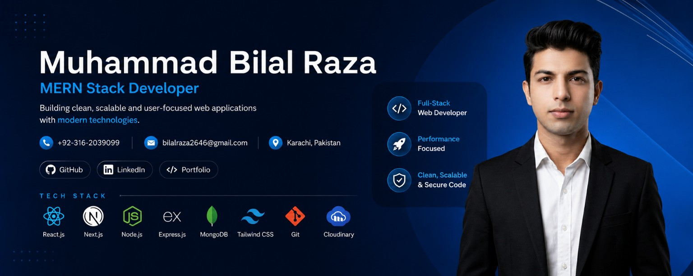
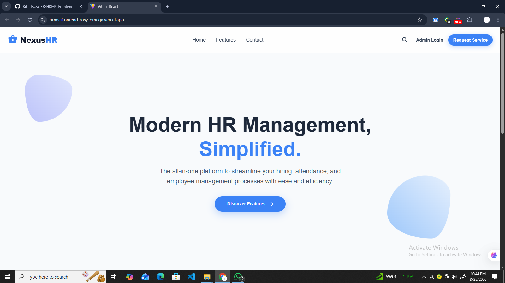
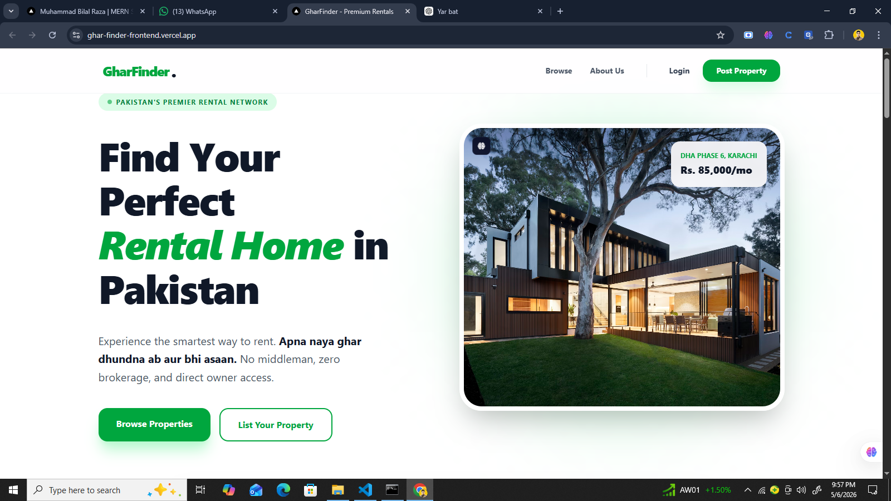
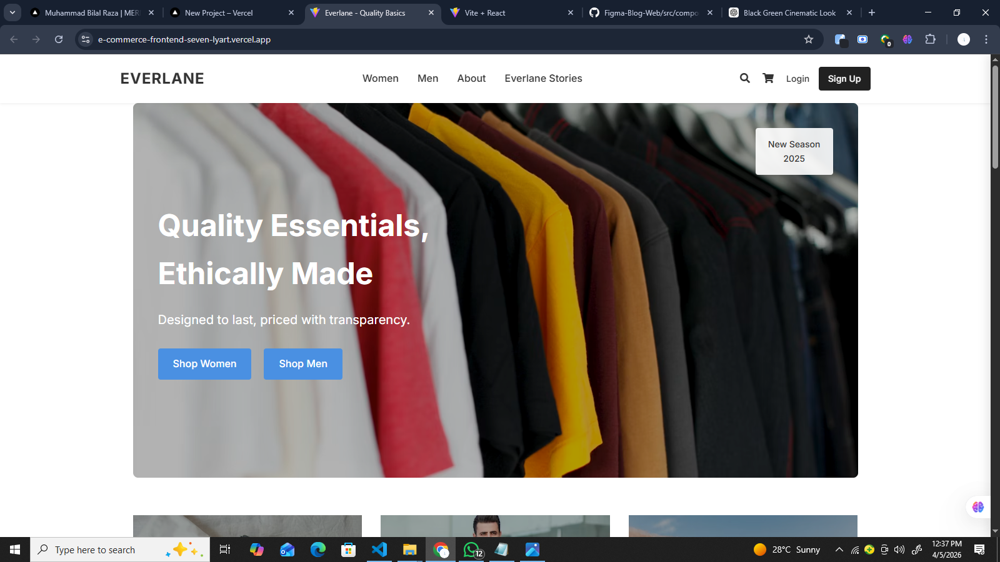
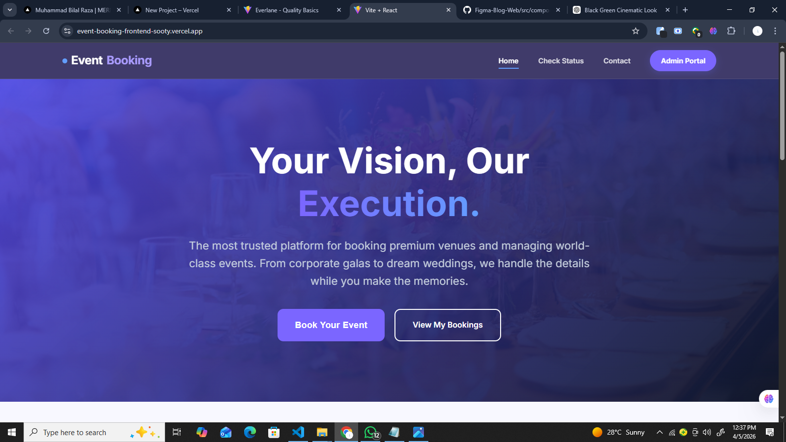

  

<h1 align="center">Hi 👋, I'm Muhammad Bilal Raza</h1>

<h3 align="center">
🚀 MERN Stack Developer | Building Scalable Web Applications
</h3>

  

  

  

  

  

  

---

# 💫 About Me

### 👨‍💻 Who Am I?

I'm a passionate **MERN Stack Developer** from Karachi, Pakistan, focused on building modern, scalable, and user-friendly web applications.

I enjoy transforming ideas into real products and continuously improving my skills in frontend and backend development.

### 🎯 Current Focus

- 🔭 Building a SaaS-based HRMS Platform
- 🌱 Learning NestJS, TypeScript & PostgreSQL
- 💡 Exploring scalable backend architectures
- 🚀 Improving system design & API development
- 🎨 Creating modern UI/UX with React & MUI

### 💼 Looking For

- Internship Opportunities
- Junior MERN Stack Developer Roles
- Open Source Collaboration
- Real-World Development Experience

### ⚡ Fun Fact

> "It works perfectly... until I show it to someone." 😅

 

---

# 🛠️ Tech Stack

## 🎨 Frontend

---

## ⚙️ Backend

---

## 🗄️ Database

---

## 🔧 Tools & Platforms

---

## ☁️ Additional Technologies

---

# 🏆 GitHub Trophies

---
# 🚀 Featured Projects

---

## 🏢 HRMS SaaS

  

A complete **Multi-Company HR Management System (SaaS)** featuring employee management, attendance, leave requests, recruitment, role-based authentication, dashboards, and Cloudinary file uploads.

**⚙️ Tech Stack**
`React` `Node.js` `Express.js` `MongoDB` `JWT` `Material UI` `Cloudinary`

  
  

---

## 🏠 GharFinder

  

A modern real estate platform that allows users to browse, search and manage residential and commercial properties with a clean and responsive UI.

**⚙️ Tech Stack**
`Next.js` `React` `Tailwind CSS` `Node.js` `Express.js` `MongoDB` `JWT` `Cloudinary`

  
  

---

## 🛒 E-Commerce Platform

  

A full-stack e-commerce application featuring product listings, shopping cart, authentication, order management and secure payment integration.

**⚙️ Tech Stack**
`React` `Node.js` `Express.js` `MongoDB` `Cloudinary` `Bcrypt.js`

  
  

---

## 🎟️ Event Booking Platform

  

A responsive event booking system where users can browse events, reserve seats and manage bookings through an intuitive interface.

**⚙️ Tech Stack**
`React` `Node.js` `Express.js` `MongoDB`

  
  

---

# 💼 Experience

## 🚀 MERN Stack Developer Intern — CodeAlpha
**Duration:** Remote Internship

- Developed responsive web applications using the MERN Stack.
- Built reusable React components.
- Integrated REST APIs.
- Worked with Git & GitHub for version control.
- Improved debugging and problem-solving skills.

---

# 📊 GitHub Statistics

  
  

  

---

  

---

  <i>⭐ Agar koi project pasand aaye toh star zaroor dena!</i>

---

# 📊 GitHub Analytics

---

# 🐍 Contribution Snake

---

# 🤝 Connect With Me

---

### 🚀 Building Modern Web Applications One Commit at a Time

⭐ Thanks for visiting my profile!

